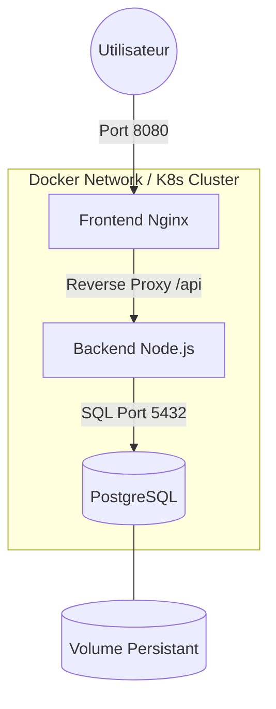

---

# 🏥 VitalSync - Plateforme de Gestion de Données Médicales


## 📝 Description du projet
**VitalSync** est une application web conteneurisée conçue pour la gestion sécurisée et performante des données de santé. L'architecture est divisée en trois composants principaux pour garantir une séparation nette des responsabilités (SOC) :
* **Frontend** : Interface utilisateur servie par Nginx.
* **Backend** : API REST développée sous Node.js (Express).
* **Database** : Persistance des données via PostgreSQL 15.

## 🏗️ Architecture Technique
L'application repose sur une architecture en micro-services orchestrée :
1.  **Le Frontend (Nginx)** agit comme un serveur de fichiers statiques et un **Reverse Proxy** pour rediriger les appels API vers le backend, évitant ainsi les problématiques de CORS.
2.  **Le Backend (Node.js)** gère la logique métier et la communication avec la base de données.
3.  **PostgreSQL** stocke les informations de manière persistante grâce à des volumes Docker ou des PersistentVolumeClaims Kubernetes.


## 🚀 Lancement Local (Quick Start)

### Prérequis
* Docker & Docker Compose
* Git

### Installation
```bash
# Cloner le projet
git clone <url-du-repo>
cd vitalsync

# Lancer l'infrastructure complète
docker compose up --build -d
```
L'application sera accessible sur :
* **Frontend** : `http://localhost:8080`
* **API Healthcheck** : `http://localhost:3000/health`

## ⚙️ Pipeline CI/CD (GitHub Actions)
La pipeline automatisée se déclenche à chaque `push` sur la branche `develop` et lors des `pull requests` vers `main`.

1.  **🧪 Lint & Tests** : Vérification de la syntaxe et exécution des tests unitaires (Jest) pour le backend.
2.  **🐳 Build & Push** : Construction des images Docker (Multi-stage build) et publication sur le **GitHub Container Registry (GHCR)**.
3.  **🚀 Simulation Staging** : Test de déploiement pour valider l'intégrité des manifests.

## 🛡️ Choix Techniques & Justifications

| Composant | Technologie | Justification |
| :--- | :--- | :--- |
| **Base Image** | `node:20-alpine` | Utilisation d'Alpine pour réduire la taille de l'image (~50Mo vs ~900Mo) et limiter la surface d'attaque. |
| **Serveur Web** | `Nginx` | Choisi pour sa légèreté et sa capacité à gérer le Reverse Proxy de manière native. |
| **Build** | `Multi-stage` | Permet d'exclure les outils de build et les dépendances de test de l'image de production finale. |
| **Orchestration** | `Kubernetes` | Utilisation de 2 réplicas pour le backend afin d'assurer une haute disponibilité (HA). |
| **Persistance** | `Volumes / PVC` | Indispensable pour PostgreSQL afin que les données médicales survivent au cycle de vie éphémère des conteneurs. |

## 🛠️ Schéma d'Architecture (Mermaid)


---

### ✅ Checklist pour ton PDF de rendu :
1.  **Page de garde** avec mention "Anonyme".
2.  **Sommaire**.
3.  **Captures d'écran** :
    * Résultat de `docker images` (montre les tailles réduites).
    * Onglet **Actions** de GitHub (tout en vert).
    * Résultat de `kubectl get pods` (même si c'est en attente).
4.  **Code** : Tes Dockerfiles, ton `docker-compose.yml`, ton `main.yml` et tes manifests K8s.
5.  **Le contenu de ce README** collé proprement à la fin.